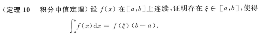

@import "my-style.less"

# 平时不熟的公式及结论

---

## 高数

### 极限

> **无穷小比阶时**

当 $x\rightarrow\infty$ 时，$a^x\gg x^\beta \gg \ln^{a}{x}$

### 中值定理

### 微分学

> **判断连续**

$$
\left\{
    \begin{array}{ll}
    f(x)连续\nRightarrow |f(x)|连续 \\\\
    |f(x)|连续\nRightarrow f(x)连续
    \end{array}
    \right.
$$
反例：
$$
f(x)=\left\{
    \begin{array}{ll}
    -1&& x\geq 0 \\\\
    1&&x\lt 0
    \end{array}
    \right.
$$

> **判断极值点，拐点**

1. 判别极值第三充分条件

2. 判别拐点第三充分条件

> **几何应用**

曲率公式：

$$
k=\frac{|y^{''}|}{[1+(y^{'})^{2}]^{\frac{3}{2}}}
$$

> **判断有界性**

$$
1.\quad f(x)在[a,b]上连续 \Rightarrow f(x)在[a,b]上有界
$$

$$
2.\quad f(x)在(a,b)上连续，且 \lim_{x \to a^+}{f(x)}和\lim_{x \to b^-}{f(x)}均存在 \Rightarrow  f(x)在(a,b)上有界
$$

$$
3.\quad f'(x)在有限区间(a,b)有界，则f(x)在(a,b)上有界
$$

<strong>证明</strong> 

### 多元函数积分学

> **方向导数**

$$
\frac{\partial{u}}{\partial{l}}|_{P_{0}}=u_{x}^{'}(P_0)\cos{\alpha}+u_{y}^{'}(P_0)\cos{\beta}+u_{z}^{'}(P_0)\cos{\gamma}
$$

### 积分

> **不定积分**

[不定积分公式](/合并（答案版）.pdf)

> **分部积分法😅** （记住中间要加正负号！！！）

> **原函数存在定理🐟**（不能忽视基础！！！）

1. 连续函数f(x)必有原函数F(x);
2. 含有第一类间断点和无穷间断点的函数f(x)在包含该间断点的区间内必没有原函数F(x);
3. 含有振荡间断点可能有原函数。
   

> **定积分存在定理🚗**

$$
\left\{
    \begin{array}{ll}
    f(x)可积\Rightarrow F(x)连续 \\\\
    f(x)连续\Rightarrow F(x)可导
    \end{array}
    \right.
$$
如果$x=x_0$是f(x)的可去间断点，则F(x)在$x=x_0$处可导，但$F'(x_0)\neq f(x_0)$

> **不定积分判断敛散性**

>> ***1. 无穷区间***

>> ***2. 无界函数***

>> ***3. 一些结论***
+ 反常积分收敛时才能用奇偶性
+ 对于$ \displaystyle \lim_{R \to\infty}\int_{-R}^{R}f(x)dx$，应该先算定积分，再取极限，不同于$ \displaystyle \int_{-\infty}^{+\infty}f(x)dx $

> **判断可积**

$$
\left\{
    \begin{array}{ll}
    f(x)可积\nRightarrow |f(x)|可积 \\\\
    |f(x)|可积\nRightarrow f(x)可积
    \end{array}
    \right.
$$
反例
$$
f(x)=\left\{
    \begin{array}{ll}
    -1 && x\in Q \\\\
    1 && x\notin Q
    \end{array}
    \right.
$$
原因：此时有无数个间断点

> **几何应用**

>> ***形心***

>> ***弧长***

> **物理应用**

>> ***变力沿直线做功***

>> ***抽水做功***

>> ***水压力***

### 微分方程

> **一阶线性微分方程**：形如  $ y^{'}+p(x)y=q(x) $

$ y=e^{-\int{p(x)dx}}[\int{e^{\int{p(x)dx}}}\cdot q(x)dx+C] $

---

> **伯努利方程**：形如 $ y^{'}+p(x)y=q(x)y^{n}\,(n\neq0,1) $

$ step:$
$ (1)先变形为\,y^{-n}\cdot y^{'}+p(x)y^{1-n}=q(x)$
$ (2)令z=y^{1-n},得 \frac{dz}{dx}=(1-n)y^{-n}\frac{dy}{dx},则\frac{1}{1-n}\cdot \frac{dz}{dx}+p(x)z=q(x) $
$ (3)代入一阶线性微分方程\,\,\,y=e^{-\int{p(x)dx}}[\int{e^{\int{p(x)dx}}}\cdot q(x)dx+C] $

---

> **二阶可降阶**

>> $ 1.  y^{''}=f(x,y^{'})型 $
>>

$令y^{'}=p(x),y^{''}=p^{'},\,则原方程变为\frac{dp}{dx}=f(x,p) $

>> $ 2. y^{''}=f(y,y^{'})型 $
>>

$ 令y^{'}=p, y^{''}=\frac{dp}{dx}=\frac{dp}{dy}\cdot \frac{dy}{dx}=\frac{dp}{dy}\cdot p,原方程变为p\frac{dp}{dy}=f(y,p)\Rightarrow p=\phi(y,C_1)\Rightarrow分离变量法 $

---

> **二阶常系数齐次线性方程**

--- 

> **二阶常系数非齐次线性微分方程的特解**：形如$ y^{''}+py^{'}+qy=f(x) $

设$P_n(x)$, $P_m(x)$分别为$x$的$n$次和$m$次多项式
(1) 当自由项为$f(x)=P_n(x)e^{ax}$时，特解为 $ y^{*}=e^{ax}Q_n(x)x^k$,

$$
\left\{
    \begin{array}{ll}
    e^{ax}照抄 \\\\
    Q_n(x)为x的n次多项式 \\\\
    k=\left\{
        \begin{array}{ll}
        0&&\alpha 不是特征根，\\
        1&&\alpha 是单特征根，\\
        2&&\alpha 是二重根. \\
        \end{array}
        \right.\\
    \end{array}
    \right.
$$

(2) 当自由项$ f(x)=e^{ax}[P_m(x)\cos{\beta x+P_n}] $时，特解要设为

$$
y^{*}=e^{ax}[Q^{(1)}_{l}(x)\cos{\beta x}+Q^{(2)}_{l}(x)\sin{\beta x}]x^k\,\,,
$$

其中

$$
\left\{
    \begin{array}{ll}
    e^{ax}照抄 \\\\
    l=\max\{{m,n}\},Q^{(1)}_{l}(x), Q^{(2)}_{l}(x)分别为x的两个不同的l次多项式\\\\
    k=\left\{
        \begin{array}{ll}
        0&&\alpha\pm\beta i 不是特征根，\\
        1&&\alpha\pm\beta i是特征根。\\
        \end{array}
        \right.\\
    \end{array}
    \right.
$$

---

> **n阶常系数齐次线性微分方程的解**

---

> **欧拉方程**

### 多元函数

> **判断可微**

> **判断偏导数连续**

> **小结**  ***<text style="color: #ff0000; font-weight: bold; font-size: 24px; text-transform: uppercase;">（注意逆否命题啊！！！）:angel:</text>*** 

<text style="color: #ff0000; font-weight: bold; font-size: 24px; text-transform: uppercase;">不要忘记逆否命题！！！:man_with_gua_pi_mao:</text>

---

## 线性代数

### 矩阵

> **秩越乘越小，越拼越大**

$ r(AB)\leq \min(r(A),r(B))\leq r(A|B)\leq r(A)+r(B) $

> **A转置相关**

$ r(A)=r(A^T)=r(AA^T)=r(A^TA) $

> **矩阵A的幂 ( r(A)=1 )**

$ A^{n}=[tr({A})]^{n-1}\cdot A $  , 需满足$ r(A)=1 $

> **施密特正交化**

$\textcircled{1}\quad正交化$

$$
\begin{array}{l}
\beta_1=\alpha_1\,,\\\\
\beta_2=\alpha_2-\frac{(\alpha_2,\beta_1)}{(\beta_1,\beta_1)}\beta_1.
\end{array}
$$

$\textcircled{2}\quad标准化$

$$
\begin{array}{l}
\eta_1=\frac{\beta_1}{||\beta_1||} \,,\\\\
\eta_2=\frac{\beta_2}{||\beta_2||}.
\end{array}
$$

> **$A^*$的行列式()** ~~这能忘是真的fw😂~~

$ |A^*|=|A|^{n-1} $

### 特征值与特征向量

> **特征值性质**

$ \textcircled{1}\quad\sum_{i=1}^{n}{\lambda_i}=tr(A); \\
\textcircled{2}\quad\prod_{i=1}^{n}{\lambda_i}=|A|;\\
\textcircled{3}\quad三角矩阵主对角线元素即为特征值.
$

> **A相关特征值和特征向量**

|     **矩阵**     |    $A$    |    $kA$    |    $A^k$    |    $f(A)$    |      $A^{-1}$      |             $A^{*}$             | $P^{-1}AP$ |
| :--------------------: | :---------: | :----------: | :-----------: | :------------: | :-------------------: | :-------------------------------: | :-----------: |
|    **特征值**    | $\lambda$ | $k\lambda$ | $\lambda^k$ | $f(\lambda)$ | $\frac{1}{\lambda}$ | $\frac{\vert A \vert}{\lambda}$ |  $\lambda$  |
| **对应特征向量** |   $\xi$   |   $\xi$   |    $\xi$    |    $\xi$    |        $\xi$        |              $\xi$              | $P^{-1}\xi$ |

> **秩为1的矩阵的性质** ~~牢记重要结论⚠️~~

1. n阶矩阵A的秩为1$\Leftrightarrow \exist n$维非零列向量$\alpha,\beta$，使$A=\alpha\beta^T$.
2. $tr(\alpha\beta^T)=\beta^T\alpha$  ($\alpha$,$\beta$为n维列向量).
3. 对于$A=\alpha\beta^T$ ($\alpha$,$\beta$为n维列向量),有$A^n=l^{n-1}A$, 其中 $l=\beta^T\alpha=tr(A)$.
4. 若n阶方阵$A=\alpha\beta^T$的秩为1，则A的特征值为$ \lambda_1=tr(A),\lambda_2=...=\lambda_n=0 $.
5. 若n阶方阵$A=\alpha\beta^T$的秩为1，则当$tr(A)\ne0$时，A可对角化；当$tr(A)=0时$，A不可对角化.

---

## 线性代数

### 随机事件与概率

> **重要公式求概率**

> **常见随机变量分布类型**

> **卷积公式**

见P53