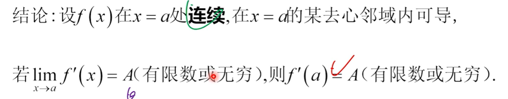

@import "my-style.less"

# 强化班
---
## 函数极限

<text style="font-size:20px;">$ (1+x)^{\frac{1}{x}}-e \sim -\frac{e}{2}x\quad (x\to 0^+) $</text>

<text style="font-size:20px;">$ (1+\frac{1}{n})^{n}-e \sim -\frac{e}{2}\cdot\frac{1}{n}\quad (n\to +\infty) $</text>

<text style="font-size:20px;">$ \ln(x+\sqrt{1+x^2}) \sim x\quad(x\to 0) $</text>

<text style="font-size:20px;">$ a^x-1=e^{x\ln a}-1 \sim x\ln{a}\quad(x\to 0) $

<text style="font-size:20px;">$ 1-\cos^a{x} \sim \frac{a}{2}x^2\quad(x\to 0) $

## 一元微分学

> **特殊结论** （见第三章B组第3题）

<text style="font-size:20px;">$ 若g(x)在x_0处可导，h(x)在x_0连续且不可导，则 $
$$ f(x)=g(x)h(x)在x_0处可导\Longleftrightarrow g(x_0)=0 $$</text>

> **关于 $ \lim_{x\to a}f'(x)与f'(a) $**

<text style="font-size:20px;">$$\lim_{x\to a}f'(x)与f'(a)是两个不同的概念$$
当f(x)在x=a处连续时，</text>

> **一些感悟**

<text style="font-size:20px;">今天才发现导数存在和导数极限存在是两个不同概念：
导数存在要求左导等于右导，导数极限存在不一定导数存在。。。</text><text style="font-size:36px">:triumph:</text>

## 微分几何应用

> **解题技巧**

<text style="font-size:20px;">$$ e^f-e^g=e^g(e^{f-g}-1)\sim e^g(f-g)\quad (f-g\sim 0) $$</text>